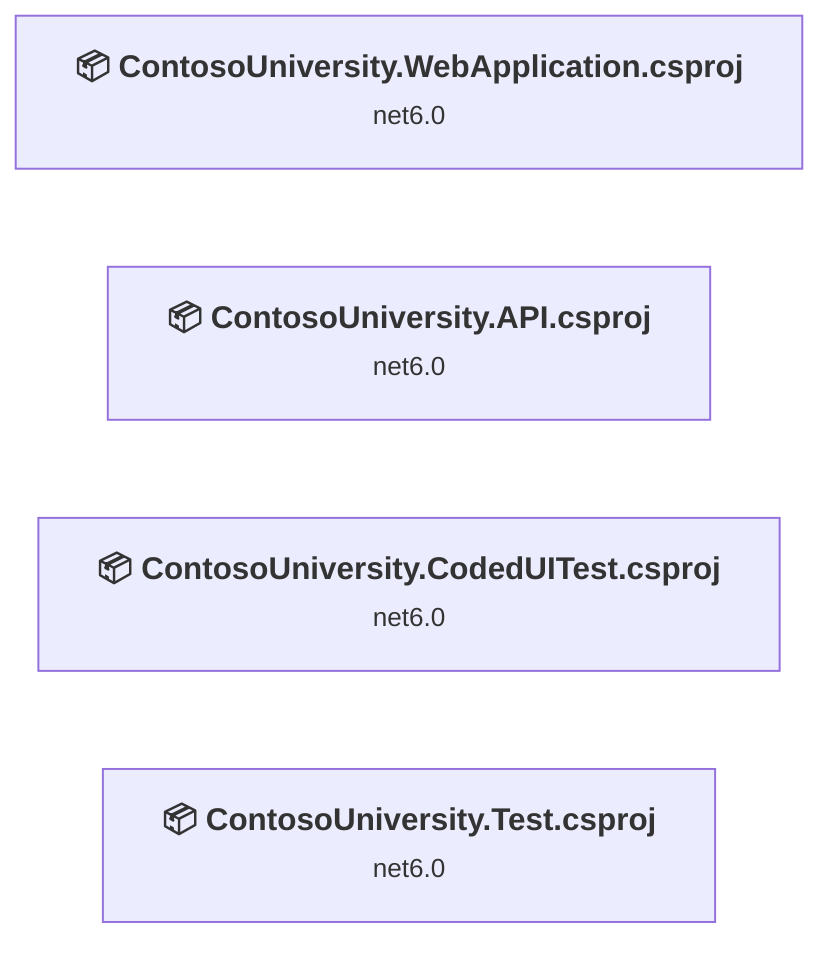
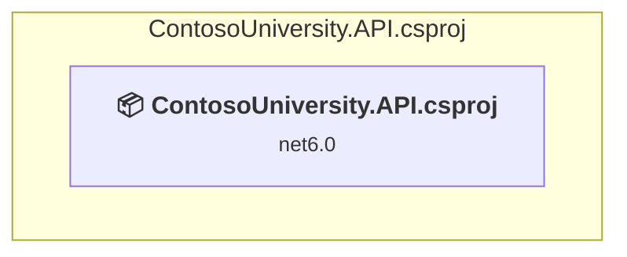
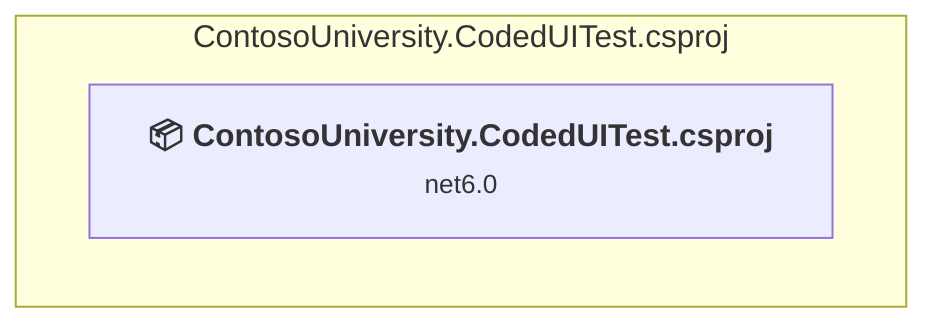
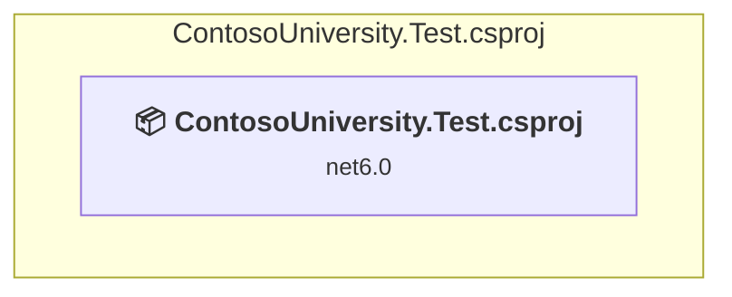
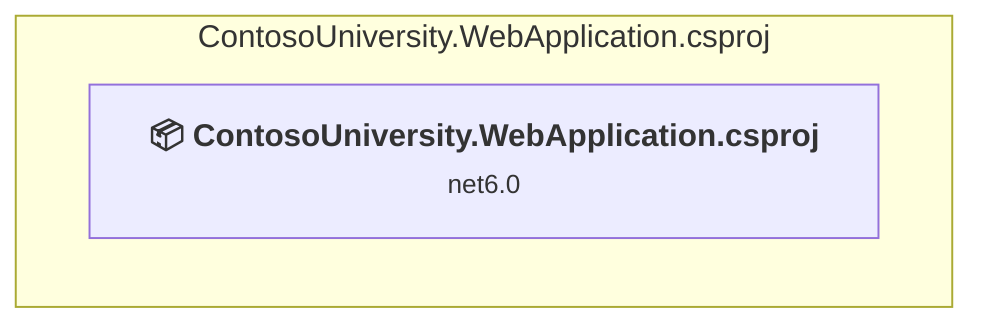

# Projects and dependencies analysis

This document provides a comprehensive overview of the projects and their dependencies in the context of upgrading to .NETCoreApp,Version=v10.0.

## Table of Contents

- [Executive Summary](#executive-Summary)
  - [Highlevel Metrics](#highlevel-metrics)
  - [Projects Compatibility](#projects-compatibility)
  - [Package Compatibility](#package-compatibility)
  - [API Compatibility](#api-compatibility)
  - [Binding Redirect Configuration](#binding-redirect-configuration)
- [Aggregate NuGet packages details](#aggregate-nuget-packages-details)
- [Top API Migration Challenges](#top-api-migration-challenges)
  - [Technologies and Features](#technologies-and-features)
  - [Most Frequent API Issues](#most-frequent-api-issues)
- [Projects Relationship Graph](#projects-relationship-graph)
- [Project Details](#project-details)

  - [ContosoUniversity.API\ContosoUniversity.API.csproj](#contosouniversityapicontosouniversityapicsproj)
  - [ContosoUniversity.CodedUITest\ContosoUniversity.CodedUITest.csproj](#contosouniversitycodeduitestcontosouniversitycodeduitestcsproj)
  - [ContosoUniversity.Test\ContosoUniversity.Test.csproj](#contosouniversitytestcontosouniversitytestcsproj)
  - [ContosoUniversity.WebApplication\ContosoUniversity.WebApplication.csproj](#contosouniversitywebapplicationcontosouniversitywebapplicationcsproj)

## Executive Summary

### Highlevel Metrics

| Metric | Count | Status |
| :--- | :---: | :--- |
| Total Projects | 4 | All require upgrade |
| Total NuGet Packages | 23 | 12 need upgrade |
| Total Code Files | 95 |  |
| Total Code Files with Incidents | 9 |  |
| Total Lines of Code | 4290 |  |
| Total Number of Issues | 40 |  |
| Estimated LOC to modify | 17+ | at least 0.4% of codebase |

### Projects Compatibility

| Project | Target Framework | Difficulty | Package Issues | API Issues | Binding Issues | Est. LOC Impact | Description |
| :--- | :---: | :---: | :---: | :---: | :---: | :---: | :--- |
| [ContosoUniversity.API\ContosoUniversity.API.csproj](#contosouniversityapicontosouniversityapicsproj) | net6.0 | 🟢 Low | 13 | 0 | 0 |  | AspNetCore, Sdk Style = True |
| [ContosoUniversity.CodedUITest\ContosoUniversity.CodedUITest.csproj](#contosouniversitycodeduitestcontosouniversitycodeduitestcsproj) | net6.0 | 🟢 Low | 0 | 5 | 0 | 5+ | DotNetCoreApp, Sdk Style = True |
| [ContosoUniversity.Test\ContosoUniversity.Test.csproj](#contosouniversitytestcontosouniversitytestcsproj) | net6.0 | 🟢 Low | 0 | 0 | 0 |  | DotNetCoreApp, Sdk Style = True |
| [ContosoUniversity.WebApplication\ContosoUniversity.WebApplication.csproj](#contosouniversitywebapplicationcontosouniversitywebapplicationcsproj) | net6.0 | 🟢 Low | 6 | 12 | 0 | 12+ | AspNetCore, Sdk Style = True |

### Package Compatibility

| Status | Count | Percentage |
| :--- | :---: | :---: |
| ✅ Compatible | 11 | 47.8% |
| ⚠️ Incompatible | 2 | 8.7% |
| 🔄 Upgrade Recommended | 10 | 43.5% |
| ***Total NuGet Packages*** | ***23*** | ***100%*** |

### API Compatibility

| Category | Count | Impact |
| :--- | :---: | :--- |
| 🔴 Binary Incompatible | 0 | High - Require code changes |
| 🟡 Source Incompatible | 6 | Medium - Needs re-compilation and potential conflicting API error fixing |
| 🔵 Behavioral change | 11 | Low - Behavioral changes that may require testing at runtime |
| ✅ Compatible | 17146 |  |
| ***Total APIs Analyzed*** | ***17163*** |  |

## Aggregate NuGet packages details

| Package | Current Version | Suggested Version | Projects | Description |
| :--- | :---: | :---: | :--- | :--- |
| Azure.Extensions.AspNetCore.Configuration.Secrets | 1.2.2 |  | [ContosoUniversity.API.csproj](#contosouniversityapicontosouniversityapicsproj) | ✅Compatible |
| Azure.Identity | 1.8.2 | 1.21.0 | [ContosoUniversity.API.csproj](#contosouniversityapicontosouniversityapicsproj) | NuGet package contains security vulnerability |
| Bogus | 34.0.2 |  | [ContosoUniversity.API.csproj](#contosouniversityapicontosouniversityapicsproj) | ✅Compatible |
| coverlet.collector | 3.1.2 |  | [ContosoUniversity.Test.csproj](#contosouniversitytestcontosouniversitytestcsproj) | ✅Compatible |
| Microsoft.ApplicationInsights.AspNetCore | 2.21.0 |  | [ContosoUniversity.API.csproj](#contosouniversityapicontosouniversityapicsproj) [ContosoUniversity.WebApplication.csproj](#contosouniversitywebapplicationcontosouniversitywebapplicationcsproj) | ⚠️NuGet package is deprecated |
| Microsoft.AspNetCore.Mvc.NewtonsoftJson | 6.0.5 | 10.0.7 | [ContosoUniversity.API.csproj](#contosouniversityapicontosouniversityapicsproj) | NuGet package upgrade is recommended |
| Microsoft.AspNetCore.Razor.Language | 6.0.15 |  | [ContosoUniversity.API.csproj](#contosouniversityapicontosouniversityapicsproj) [ContosoUniversity.WebApplication.csproj](#contosouniversitywebapplicationcontosouniversitywebapplicationcsproj) | NuGet package functionality is included with framework reference |
| Microsoft.Data.SqlClient | 5.0.1 | 7.0.1 | [ContosoUniversity.API.csproj](#contosouniversityapicontosouniversityapicsproj) | NuGet package contains security vulnerability |
| Microsoft.EntityFrameworkCore | 7.0.4 | 10.0.7 | [ContosoUniversity.API.csproj](#contosouniversityapicontosouniversityapicsproj) | NuGet package upgrade is recommended |
| Microsoft.EntityFrameworkCore.SqlServer | 7.0.4 | 10.0.7 | [ContosoUniversity.API.csproj](#contosouniversityapicontosouniversityapicsproj) | NuGet package upgrade is recommended |
| Microsoft.EntityFrameworkCore.Tools | 7.0.4 | 10.0.7 | [ContosoUniversity.API.csproj](#contosouniversityapicontosouniversityapicsproj) | NuGet package upgrade is recommended |
| Microsoft.Extensions.Azure | 1.6.3 |  | [ContosoUniversity.API.csproj](#contosouniversityapicontosouniversityapicsproj) | ⚠️NuGet package is deprecated |
| Microsoft.Extensions.DependencyInjection | 6.0.0 | 10.0.7 | [ContosoUniversity.WebApplication.csproj](#contosouniversitywebapplicationcontosouniversitywebapplicationcsproj) | NuGet package upgrade is recommended |
| Microsoft.Extensions.DependencyInjection.Abstractions | 6.0.0 | 10.0.7 | [ContosoUniversity.WebApplication.csproj](#contosouniversitywebapplicationcontosouniversitywebapplicationcsproj) | NuGet package upgrade is recommended |
| Microsoft.NET.Test.Sdk | 17.2.0 |  | [ContosoUniversity.CodedUITest.csproj](#contosouniversitycodeduitestcontosouniversitycodeduitestcsproj) [ContosoUniversity.Test.csproj](#contosouniversitytestcontosouniversitytestcsproj) | ✅Compatible |
| Microsoft.VisualStudio.Web.CodeGeneration.Design | 6.0.4 | 10.0.2 | [ContosoUniversity.API.csproj](#contosouniversityapicontosouniversityapicsproj) [ContosoUniversity.WebApplication.csproj](#contosouniversitywebapplicationcontosouniversitywebapplicationcsproj) | NuGet package upgrade is recommended |
| MSTest.TestAdapter | 2.2.10 |  | [ContosoUniversity.CodedUITest.csproj](#contosouniversitycodeduitestcontosouniversitycodeduitestcsproj) [ContosoUniversity.Test.csproj](#contosouniversitytestcontosouniversitytestcsproj) | ✅Compatible |
| MSTest.TestFramework | 2.2.10 |  | [ContosoUniversity.CodedUITest.csproj](#contosouniversitycodeduitestcontosouniversitycodeduitestcsproj) [ContosoUniversity.Test.csproj](#contosouniversitytestcontosouniversitytestcsproj) | ✅Compatible |
| Newtonsoft.Json | 13.0.3 | 13.0.4 | [ContosoUniversity.WebApplication.csproj](#contosouniversitywebapplicationcontosouniversitywebapplicationcsproj) | NuGet package upgrade is recommended |
| NSwag.AspNetCore | 13.18.2 |  | [ContosoUniversity.API.csproj](#contosouniversityapicontosouniversityapicsproj) | ✅Compatible |
| Selenium.WebDriver | 4.1.1 |  | [ContosoUniversity.CodedUITest.csproj](#contosouniversitycodeduitestcontosouniversitycodeduitestcsproj) | ✅Compatible |
| Selenium.WebDriver.ChromeDriver | 101.0.4951.4100 |  | [ContosoUniversity.CodedUITest.csproj](#contosouniversitycodeduitestcontosouniversitycodeduitestcsproj) | ✅Compatible |
| System.Runtime.Extensions | 4.3.1 |  | [ContosoUniversity.API.csproj](#contosouniversityapicontosouniversityapicsproj) | NuGet package functionality is included with framework reference |

## Top API Migration Challenges

### Technologies and Features

| Technology | Issues | Percentage | Migration Path |
| :--- | :---: | :---: | :--- |

### Most Frequent API Issues

| API | Count | Percentage | Category |
| :--- | :---: | :---: | :--- |
| T:System.Uri | 6 | 35.3% | Behavioral Change |
| M:System.TimeSpan.FromSeconds(System.Double) | 5 | 29.4% | Source Incompatible |
| M:System.Uri.#ctor(System.String) | 2 | 11.8% | Behavioral Change |
| M:Microsoft.Extensions.DependencyInjection.HttpClientFactoryServiceCollectionExtensions.AddHttpClient(Microsoft.Extensions.DependencyInjection.IServiceCollection,System.String,System.Action{System.Net.Http.HttpClient}) | 2 | 11.8% | Behavioral Change |
| M:System.TimeSpan.FromMilliseconds(System.Double) | 1 | 5.9% | Source Incompatible |
| M:Microsoft.AspNetCore.Builder.ExceptionHandlerExtensions.UseExceptionHandler(Microsoft.AspNetCore.Builder.IApplicationBuilder,System.String) | 1 | 5.9% | Behavioral Change |

## Projects Relationship Graph

Legend:
📦 SDK-style project
⚙️ Classic project

## Project Details

### ContosoUniversity.API\ContosoUniversity.API.csproj

#### Project Info

- **Current Target Framework:** net6.0
- **Proposed Target Framework:** net10.0
- **SDK-style**: True
- **Project Kind:** AspNetCore
- **Dependencies**: 0
- **Dependants**: 0
- **Number of Files**: 28
- **Number of Files with Incidents**: 1
- **Lines of Code**: 1217
- **Estimated LOC to modify**: 0+ (at least 0.0% of the project)

#### Dependency Graph

Legend:
📦 SDK-style project
⚙️ Classic project

### API Compatibility

| Category | Count | Impact |
| :--- | :---: | :--- |
| 🔴 Binary Incompatible | 0 | High - Require code changes |
| 🟡 Source Incompatible | 0 | Medium - Needs re-compilation and potential conflicting API error fixing |
| 🔵 Behavioral change | 0 | Low - Behavioral changes that may require testing at runtime |
| ✅ Compatible | 1466 |  |
| ***Total APIs Analyzed*** | ***1466*** |  |

### ContosoUniversity.CodedUITest\ContosoUniversity.CodedUITest.csproj

#### Project Info

- **Current Target Framework:** net6.0
- **Proposed Target Framework:** net10.0
- **SDK-style**: True
- **Project Kind:** DotNetCoreApp
- **Dependencies**: 0
- **Dependants**: 0
- **Number of Files**: 5
- **Number of Files with Incidents**: 3
- **Lines of Code**: 301
- **Estimated LOC to modify**: 5+ (at least 1.7% of the project)

#### Dependency Graph

Legend:
📦 SDK-style project
⚙️ Classic project

### API Compatibility

| Category | Count | Impact |
| :--- | :---: | :--- |
| 🔴 Binary Incompatible | 0 | High - Require code changes |
| 🟡 Source Incompatible | 5 | Medium - Needs re-compilation and potential conflicting API error fixing |
| 🔵 Behavioral change | 0 | Low - Behavioral changes that may require testing at runtime |
| ✅ Compatible | 628 |  |
| ***Total APIs Analyzed*** | ***633*** |  |

### ContosoUniversity.Test\ContosoUniversity.Test.csproj

#### Project Info

- **Current Target Framework:** net6.0
- **Proposed Target Framework:** net10.0
- **SDK-style**: True
- **Project Kind:** DotNetCoreApp
- **Dependencies**: 0
- **Dependants**: 0
- **Number of Files**: 6
- **Number of Files with Incidents**: 1
- **Lines of Code**: 72
- **Estimated LOC to modify**: 0+ (at least 0.0% of the project)

#### Dependency Graph

Legend:
📦 SDK-style project
⚙️ Classic project

### API Compatibility

| Category | Count | Impact |
| :--- | :---: | :--- |
| 🔴 Binary Incompatible | 0 | High - Require code changes |
| 🟡 Source Incompatible | 0 | Medium - Needs re-compilation and potential conflicting API error fixing |
| 🔵 Behavioral change | 0 | Low - Behavioral changes that may require testing at runtime |
| ✅ Compatible | 43 |  |
| ***Total APIs Analyzed*** | ***43*** |  |

### ContosoUniversity.WebApplication\ContosoUniversity.WebApplication.csproj

#### Project Info

- **Current Target Framework:** net6.0
- **Proposed Target Framework:** net10.0
- **SDK-style**: True
- **Project Kind:** AspNetCore
- **Dependencies**: 0
- **Dependants**: 0
- **Number of Files**: 81
- **Number of Files with Incidents**: 4
- **Lines of Code**: 2700
- **Estimated LOC to modify**: 12+ (at least 0.4% of the project)

#### Dependency Graph

Legend:
📦 SDK-style project
⚙️ Classic project

### API Compatibility

| Category | Count | Impact |
| :--- | :---: | :--- |
| 🔴 Binary Incompatible | 0 | High - Require code changes |
| 🟡 Source Incompatible | 1 | Medium - Needs re-compilation and potential conflicting API error fixing |
| 🔵 Behavioral change | 11 | Low - Behavioral changes that may require testing at runtime |
| ✅ Compatible | 15009 |  |
| ***Total APIs Analyzed*** | ***15021*** |  |

